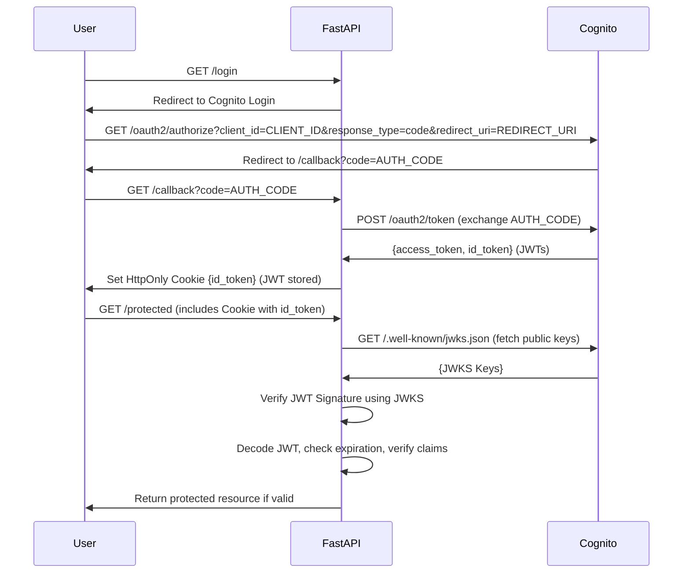
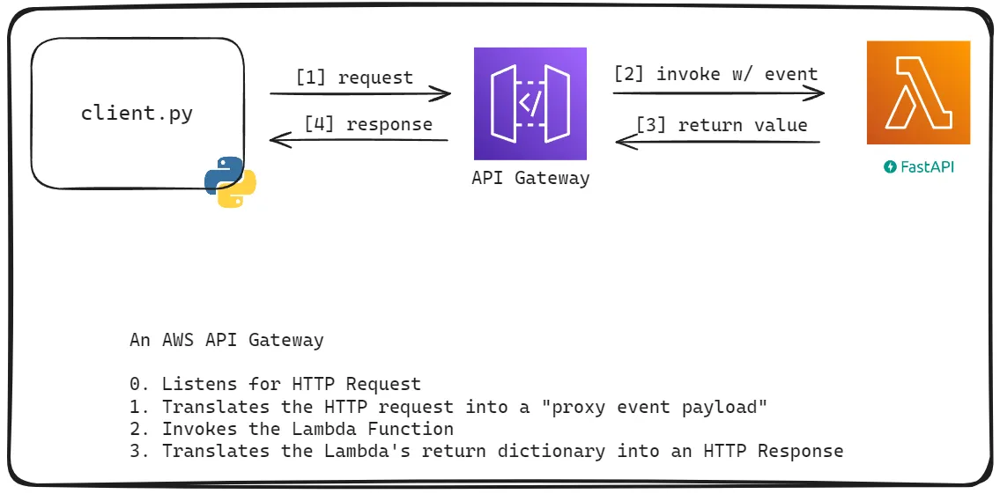
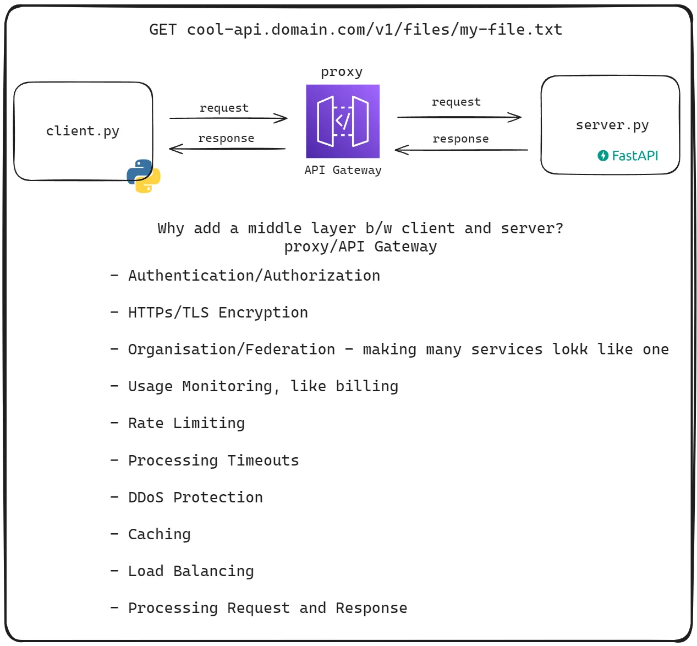

# INSTRUCTIONS FOR CURSOR

## Project Overview

You are building a property management platform for a small family business for rental units in multifamily residential buildings. The platform should have role based access control with username (email) and password (forgot password goes to email). Admin accounts control all things, managers can add info and make changes, assistants can only add information and have limited visibility of information and properties. No tenant/renter portal access at this time.

(Ideally things the solo dev understands well and easy to maintain)
Stack:

- Python (business logic)
- FastAPI
- Frontend: NextJS 14, shadcn, tailwind, Lucid Icon <https://youtu.be/2PjmPU07KNs?feature=shared&t=243>
- Alternate Frontend: Flask

## Core Functionalities

- Upload one/many rental deposit transactions
  - Transaction should include [tenant, unit, property, date, amount, term, type]
- Table of Properties
- Table of Owners/Admin
- Table of Tenants:
  - [name, contact_info, type (past, present future), unit, property]
- Tables for each property which includes rows with:
  - [unit, property, occupancy_status, tenants, lease_term, rent_amount, type]
- Expense tracker, upload expenses and assign to each property
  - [date, type, payee, memo, category, property, amount]
- Reports:
  - RentalTracker: balance of all tenants by property, filter by property and balance (past due over threshold e.g. > 1 month or $X)
  - ExpenseTracker: expenses filtered by [property, payee, category, year, month]
  - TaskTracker: kanban and/or calendar or tasks to do
     [task, type, property, assigned_to, due_date, status]

## Feature Details

### Feature 1: Tenant Balance System

#### Data Structures

- **Tenant profile**
  - Name
  - Contact information
  - Tenant ID

- **Unit association**
  - Which unit tenant occupies
  - Unit identifier

- **Property association**
  - Which property contains the unit
  - Property identifier

#### Financial Tracking

- **Payment records**
  - Amount
  - Date
  - Payment method
  - Receipt number

- **Charge records**
  - Amount
  - Date
  - Description
  - Due date

- **Balance calculation**
  - Formula: Paid - Owed
  - Example: $1000 Jan paid - $1000 Jan owed - $1000 Feb owed = $1000 total owed

#### Relationships

- One property has many units (1:N)
- One unit has one or more tenants (1:N)
- One tenant has one or more payments (1:N)

#### Platform Purpose

- Internal tool for business partners
- Centralize information to replace manual spreadsheets
- Admin-only access (not tenant-facing)

#### Core Functionality

- Searchable database of linked information
  - Tenants, units, property info

### Feature 2: Centralized Property and Tenant Information

#### Property Data Structure

- **Property Details**
  - Property ID (primary key)
  - Address (street, city, state, zip)
  - Property type (single family, multi-family, commercial)
  - Year built
  - Square footage
  - Notes/description

- **Unit Details**
  - Unit ID (primary key)
  - Property ID (foreign key)
  - Unit number/identifier
  - Bedrooms
  - Bathrooms
  - Square footage
  - Monthly rent amount
  - Status (occupied, vacant, maintenance)
  - Amenities
  - Notes

#### Tenant Data Structure (Extended)

- **Tenant Details**
  - Tenant ID (primary key)
  - Unit ID (foreign key)
  - First name
  - Last name
  - Email
  - Phone number
  - Emergency contact
  - Lease start date
  - Lease end date
  - Security deposit amount
  - Pet information
  - Vehicle information
  - Status (active, former, eviction)
  - Notes

### Feature 3: Rent Lease Creation

#### Lease Template Data Structure

- **Template**
  - Template ID
  - Template name
  - Template version
  - Created date
  - Last modified date
  - Default content (formatted text)

#### Lease Data Structure

- **Lease**
  - Lease ID (primary key)
  - Template ID (foreign key)
  - Unit ID (foreign key)
  - Tenant ID (foreign key)
  - Start date
  - End date
  - Monthly rent amount
  - Security deposit
  - Late fee terms
  - Pet policy
  - Other terms
  - Signatures (tenant, landlord)
  - Date signed
  - Status (draft, active, expired, terminated)
  - Generated document reference/link

#### Lease Generation Functionality

- Variable field replacement (tenant name, unit, dates, rent amount)
- Document storage/retrieval
- Version tracking
- Signature tracking

## UI

- sign in with email
- see dashboard, where you can look at tenants
  - billing per tenant
    - outstanding balance
    - their payments
  - maintenance requests per property
  - expense tracking per property

## Authentication Flow



## Documentation

### AWS Cognito

CognitoIdentityProvider
<https://boto3.amazonaws.com/v1/documentation/api/latest/reference/services/cognito-idp.html>

```python
import boto3
client = boto3.client('cognito-idp')
```

### FastAPI

### AWS Lambda

#### Publish code to Lambda using AWS CLI with thrid party packages installed

```bash
# Use auto-prompt in AWS CLI
aws --cli-auto-prompt
```

```bash
# publish-lambda.sh

# Publish the lambda code to AWS Lambda using the AWS CLI

# Install the required packages to the lambda-env directory
pip install --target ./lambda-env requests

# Zip the lambda-env directory
cd lambda-env
zip -r ../lambda.zip ./

# Export the AWS_PROFILE and AWS_REGION environment variables
export AWS_PROFILE=<your-profile>
export AWS_REGION=<your-region-name>

# Publish the lambda code to AWS Lambda
aws lambda update-function-code \
--function-name lambda-demo \
--zip-file fileb://../lambda.zip
```

```python
# lambda_function.py

import json
import os
import requests

BUCKET_NAME = "<your-bucket-name>"

def lambda_handler(event: dict, context):
    return {
        "text": requests.get("https://www.wikipedia.org").text[:500]
    }
```

#### Package Size in Lambda

- AWS Lambda has a maximum package size of:
    - **250 MB uncompressed**
    - **50 MB compressed**
- If the package exceeds these limits, it cannot be run in AWS Lambda unless using a Docker image-based Lambda function, which can be complex.
- If the code size exceeds more than ~10MB, then it cannot be displayed in the console code editor, but still can run the code.

#### Code Sample used in the Lecture

```bash
# Publish the lambda code to AWS Lambda using the AWS CLI

# Clean up the artifacts, lambda-env directory and lambda.zip file if they exist
rm -rf lambda-env || true
rm lambda.zip || true

# Install the required packages to the lambda-env directory
pip install --target ./lambda-env requests fastapi

# Bundle the dependencies and the lambda code into a zip file
cp lambda_function.py lambda-env/
cd lambda-env
zip -r ../lambda.zip ./

# Export the AWS_PROFILE and AWS_REGION environment variables
export AWS_PROFILE=<profile-name>
export AWS_REGION=<your-region>

# Publish the lambda code to AWS Lambda
aws lambda update-function-code \
--function-name lambda-demo \
--zip-file fileb://../lambda.zip
```

### Check Package Size

```bash
# Check the size of the zip file
du -sh lambda.zip

# Check the size of the uncompressed folder
du -sh lambda_env
```

#### Working with laters for Python Lambda Functions

(Working with laters for Python Lambda Functions)[https://docs.aws.amazon.com/lambda/latest/dg/python-layers.html#python-layer-paths]

A Lambda layer is a .zip file archive that contains supplementary code or data. Layers usually contain library dependencies, a custom runtime, or configuration files. Creating a layer involves three general steps:

- Package your layer content. This means creating a .zip file archive that contains the dependencies you want to use in your functions.
- Create the layer in Lambda.
- Add the layer to your functions.
This topic contains steps and guidance on how to properly package and create a Python Lambda layer with external library dependencies.

#### Lambda Layer Example

```
Lambda Layers
0

layer-1/
    directory/
        file1.txt  # hello!
        file2.txt  # world!
1

layer-2/
    directory/
        file1.txt  # hi
```

```bash
# publish-lambda-w-layer-docker.sh
set -ex

# arn:aws:lambda:us-west-2:905418322705:layer:cloud-course-project-python-deps:1

# aws lambda publish-layer-version --layer-name cloud-course-project-python-deps --compatible-runtimes python3.12 --zip-file fileb://lambda-layer.zip --compatible-architectures arm64 --profile cloud-course --region us-west-2

# clean up artifacts
rm -rf lambda-env || true
rm -f lambda-layer.zip || true

# install dependencies
docker logout || true  # log out to use the public ecr
docker pull public.ecr.aws/lambda/python:3.12-arm64

docker run --rm \
    --volume $(pwd):/out \
    --entrypoint /bin/bash \
    public.ecr.aws/lambda/python:3.12-arm64 \
    -c ' \
    pip install \
        -r /out/requirements.txt \
        --target /out/lambda-env/python \
    '

# bundle dependencies and handler in a zip file
cd lambda-env
zip -r ../lambda-layer.zip ./

cd ../src
zip -r ../lambda.zip ./

cd ..

# cp lambda_function.py lambda-env/
# # publish the zip file
export AWS_PROFILE=cloud-course
export AWS_REGION=us-west-2
aws lambda update-function-code \
    --function-name demo-func \
    --zip-file fileb://./lambda.zip \
    --output json | cat

LAYER_VERSION_ARN=$(aws lambda publish-layer-version \
    --layer-name cloud-course-project-python-deps \
    --compatible-runtimes python3.12 \
    --zip-file fileb://lambda-layer.zip \
    --compatible-architectures arm64 \
    --query 'LayerVersionArn' \
    --output text | cat)

aws lambda update-function-configuration \
    --function-name demo-func \
    --layers $LAYER_VERSION_ARN \
    --output json | cat
```

```bash
# publish-lambda-w-layer.sh
# arn:aws:lambda:us-west-2:905418322705:layer:cloud-course-project-python-deps:1

# aws lambda publish-layer-version --layer-name cloud-course-project-python-deps --compatible-runtimes python3.12 --zip-file fileb://lambda-layer.zip --compatible-architectures arm64 --profile cloud-course --region us-west-2

# clean up artifacts
rm -rf lambda-env || true
rm -f lambda-layer.zip || true

# install dependencies
mkdir -p lambda-env/python
pip install --target ./lambda-env/python -r requirements.txt

# bundle dependencies and handler in a zip file
cd lambda-env
zip -r ../lambda-layer.zip ./

cd ../src
zip -r ../lambda.zip ./

cd ..

# cp lambda_function.py lambda-env/
# # publish the zip file
export AWS_PROFILE=cloud-course
export AWS_REGION=us-west-2
aws lambda update-function-code \
    --function-name demo-func \
    --zip-file fileb://./lambda.zip \
    --output json | cat

LAYER_VERSION_ARN=$(aws lambda publish-layer-version \
    --layer-name cloud-course-project-python-deps \
    --compatible-runtimes python3.12 \
    --zip-file fileb://lambda-layer.zip \
    --compatible-architectures arm64 \
    --query 'LayerVersionArn' \
    --output text | cat)

aws lambda update-function-configuration \
    --function-name demo-func \
    --layers $LAYER_VERSION_ARN \
    --output json | cat
```

```bash
# publish-lambda.sh
# clean up artifacts
rm -rf lambda-env || true
rm -f lambda.zip || true

# install dependencies
pip install --target ./lambda-env requests fastapi

# bundle dependencies and handler in a zip file
cp lambda_function.py lambda-env/
cd lambda-env
zip -r ../lambda.zip ./

# publish the zip file
export AWS_PROFILE=cloud-course
export AWS_REGION=us-west-2
aws lambda update-function-code \
    --function-name demo-func \
    --zip-file fileb://../lambda.zip
```


### AWS API Gateway

#### Serving FastAPI on Lambda using AWS API Gateway**

Here, we’ll understand how AWS API Gateway can be helpful in deploying our REST API built with FastAPI on AWS Lambda.
Revisiting how AWS Lambda & FastAPI handles Requests and their Differences

```python
import json

def lambda_handler(event, context):
    return {
        'statusCode': 200,
        'body': json.dumps('Hello from Lambda!')
    }
```

A typical lambda function accepts majorly two major arguments: an `event` and a `context` object. It processes the `event` used to invoke and optionally returns a JSONable dictionary, whereas it is different from a FastAPI app, which listens and responds over an HTTP connection. Let’s look at the difference between them:

- **Runtime:**
    
    Lambda functions are a mortal process, which means that they need to handle requests in a finite time(~15 minutes), or else it’ll get terminated, whereas FastAPI typically runs as an immortal process, always listening for HTTP requests over a TCP connection.
    
- **Input and Output Differences:**
    
    A Lambda function accepts JSON input, processes it, and returns JSON output. On the other hand, a FastAPI app handles byte streams both as input and output, conforming to [**HTTP protocol requirements**](https://developer.mozilla.org/en-US/docs/Web/HTTP/Overview#http_flow).
    
    ```markdown
    # Request:
    GET / HTTP/1.1
    Host: developer.mozilla.org
    Accept-Language: fr
    ```
    
    ```markdown
    # Response
    HTTP/1.1 200 OK
    Date: Sat, 09 Oct 2010 14:28:02 GMT
    Server: Apache
    Last-Modified: Tue, 01 Dec 2009 20:18:22 GMT
    ETag: "51142bc1-7449-479b075b2891b"
    Accept-Ranges: bytes
    Content-Length: 29769
    Content-Type: text/html
    
    <!DOCTYPE html>… (here come the 29769 bytes of the requested web page)
    ```
    
- **Invocation Differences:**
    
    Lambda Functions are invoked by some kind of caller or invocation of an event such as AWS CLI call, S3 triggers, messages in queue(SQS), etc.
    
    A FastAPI listens for and responds to HTTP requests over a TCP connection to transfer bytes using different methods like GET, POST, PATCH, HEAD, etc.
    

#### Making Lambda & FastAPI Work Together

Keeping the above differences in mind, how we can make AWS Lambda and FastAPI work together? 

- In order to use AWS Lambda to handle requests and serve responses from our FastAPI app, we’ll make our FastAPI handle one request at a time and then shut it down. This way FastAPI can run within Lambda’s execution limits.
- Now the other part is request and response formats of Lambda and FastAPI. This is where API Gateway comes into the picture. API Gateway acts as an intermediary, that will convert HTTP requests into JSON events for Lambda and convert Lambda's JSON responses back into HTTP responses.

#### Final Architecture



- **Client Interaction**: Clients send HTTP requests to API Gateway.
- **API Gateway**:
    - Listens for HTTP requests continuously.
    - Transforms HTTP requests into JSON format suitable for Lambda.
    - Invokes Lambda function with the transformed request.
- **Lambda Function**:
    - Processes the JSON event.
    - Uses FastAPI code to handle the request.
    - Returns a JSON response.
- **Response Handling**:
    - API Gateway converts the Lambda's JSON response back into HTTP response format and sends it to the client.

#### Benefits of API Gateway

- API Gateway listens for requests continuously as an i**mmortal entity.**
- **Simplified Invocation**: Allows HTTP requests using standard libraries (e.g., `requests`, `curl`) instead of AWS-specific tools.

# **What is AWS API Gateway; What is a proxy server?**

  

#### What is a Proxy Server?

**A proxy server acts as an intermediary between clients and servers, handling requests and responses.**

An API Gateway is one of many other proxy servers available that provides functionalities for managing APIs. There are vendor solutions like Nginx, Traefik, HAProxy, and Kong that provide similar functionality and have their own strengths.

**Why add a middle layer b/w client and server?**

1. **Authentication/Authorization:**
    
    The auth logic can be delegated to proxy servers instead of directly embedding them to the server code, thus reducing complexity. Proxies can manage authentications and authorization by checking valid tokens or API keys in the request headers.
    
2. **HTTPS or TLS Encryption:**
    
    Proxies handle encryption and decryption of data like session tokens, usernames, passwords, etc., ensuring secure communication between clients and servers.
    
3. **Organization and Federation:**
            
    Proxies can route requests to different backend services based on subdomains or paths, making multiple services appear as one. This allows centralized management of authentication and encryption.
    
4. **Usage Monitoring, Rate Limiting & Timeout Management:**
    
    Proxies can monitor API usage and enforce rate limits based on API keys or keep general request counts and block further requests if the API quota gets exceeded. It can also enforce timeouts, returning a timeout response if the server takes too long to respond, protecting clients from excessive wait times.
    
5. **DDoS Protection:**
    
    Proxies can detect and throttle excessive requests from specific IP ranges, mitigating the impact of DDoS attacks.
    
6. **Caching & Load Balancing:**
    
    For repeated requests or static responses, proxies can cache those, reducing server load and improving response times for those requests. They can also distribute incoming requests across multiple server instances, managing load and improving scalability.
    
7. **Request and Response Processing:**
    
    Proxies can modify requests and responses on the fly, such as setting appropriate HTTP headers for caching or adding some extra informative headers like correlation ID in case of tracing and debugging.
    

In summary, implementing a proxy server or API Gateway between clients and backend servers in a REST API architecture offers numerous advantages in terms of security, scalability, and simplicity.